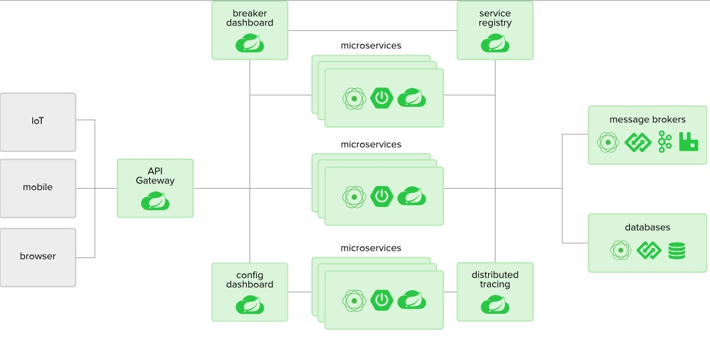
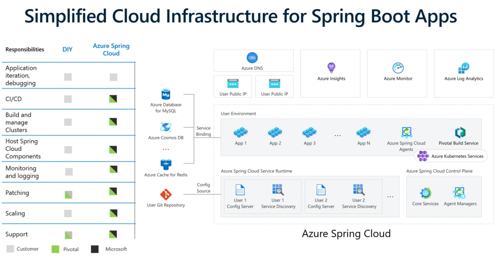

# techtalk-30042020-1

## What is Microservice

* Solution components as services
* Represent of specific domain or specific set of functions
* They build and run as loosely  coupled components
* Build for tolerate failure


## What is Spring Boot

* Runtime for Spring
+ Convention over configuration
  * Starters dependencies
  * Automatic configuration
  * Actuator
  * CLI
* Minimizes the effort associated with the boilerplate code
* Simplification of dependency management
* Embeds application server in executable JAR file

## What is Spring Cloud

* Building of distributed patterns using Spring
* Made by many Netflix projects rolled into Spring Cloud
* Can be run anywhere (Cloud Foundry, Kubernates, Azure - Preview)
+ Catalog of Spring Cloud projects ( https://spring.io/projects/spring-cloud  )
  * Spring Cloud Config
  * Spring Cloud Gateway
  * Spring Cloud Netflix (Eureka, Hystrix, Ribbon)
  * Spring Cloud Sleuth
  * Spring Cloud OpenFeign
  * Spring Cloud Security (Simplify OAuth 2.0 flows)  
  * Spring Cloud Function

## Common challenges
+ Need to leverage the combination of technologies and services
  * Message brokers
  * Databases
  * Service registry
  * Distributed tracing
  * API Gateway
* Ending up with manage manually the pieces and having to put it together by yourself
* Painful troubleshooting




## Azure Spring Cloud
* Fully managed by Microsoft and Pivotal
* Public Preview



https://cloud.spring.io/spring-cloud-azure/

## Solution plan
* Create Azure Resource Group
* Create ComsosDB Account and Database
* Create an instance of Azure Spring Cloud
* Remote Microservices initialization
* Local Microservices initialization
* Live coding and configuration (bindings, public ip)
* Deploy services to Azure
* Examine Azure deployment, App insights

## Create Azure Resources

### Create Resource Group
```
az login or azure account show
# create resource group
az group create -l westus -n rg-amiler2020-001
```

### Create and Configure Cosmos DB
```
# create cosmos db account, database, and containers (City, Weather)
az cosmosdb create -n cosmos-amiler2020-001 -g rg-amiler2020-001
az cosmosdb sql database create -a cosmos-amiler2020-001 -g rg-amiler2020-001 -n db-amiler2020-001
az cosmosdb sql container create -g rg-amiler2020-001 -a cosmos-amiler2020-001 -d db-amiler2020-001 -n City -p "/name"
az cosmosdb sql container create -g rg-amiler2020-001 -a cosmos-amiler2020-001 -d db-amiler2020-001 -n Weather -p "/city"
# Add items to containers
City
{
    "name": "Warsaw"
}
{
    "name": "Stuttgart"
}

Weather
{
    "city": "Warsaw",
    "desc": "Cloudy"
}
{
    "city": "Stuttgart",
    "desc": "Sunny"
}
```

### Create Azure Spring Cloud
```
# Add spring-cloud extension to Azure cli
az extension add --name spring-cloud
# create instance of Azure Spring Cloud and name it asc-amiler2020-001
az spring-cloud create -n asc-amiler2020-001 -g rg-amiler2020-001 -l westus2z
# configure default values so that not require to repeat it later
az configure --defaults group=rg-amiler2020-001
az configure --defaults spring-cloud=asc-amiler2020-001
```

### Setup config-server
```
az spring-cloud config-server git set -n asc-amiler2020-001 --uri https://github.com/adammiler/techtalk-30042020-1 --label config
```

### Initialize remote Microservices
```
az spring-cloud app create --name gateway
az spring-cloud app create --name city-service
az spring-cloud app create --name weather-service
az spring-cloud app create --name cities-weather-service
```
### Create Bindings

* Log into Azure and create

### Create App Insights for distributed tracing

* Long into Azure and create App Insights under Distributed Tracing

## Develop Microservices Locally

### Prepare Maven Modules
+ pom-files folder contains all mvn build modules
  * azure-spring-cloud-modules-pom.xml (parent pom)
  * config-pom.xml (will not be used here)
  * registry-pom.xml (will not be used here)    
  * gateway-pom.xml
  * city-service-pom.xml
  * weather-service-pom.xml
  * cities-weather-service-pom.xml
* prepare-modules.sh - create all maven modules


### Develop local Microservices

Describe [modules content from this repo ](https://github.com/adammiler/techtalk-30042020-1/tree/master/modules "Adam's Tech Talk Java Modules")

### Deploy services to Azure

```
az spring-cloud app deploy -n gateway --jar-path ./gateway/target/gateway.jar
az spring-cloud app deploy -n city-service --jar-path ./city-service/target/city-service.jar
az spring-cloud app deploy -n weather-service --jar-path ./weather-service/target/weather-service.jar
az spring-cloud app deploy -n cities-weather-service --jar-path ./cities-weather-service/target/cities-weather-service.jar
```

### Make gateway Public

```
az spring-cloud app update -n gateway --is-public true
az spring-cloud app show --name gateway | grep url
```

### Check services

* Log into Azure and check if all services status is UP
* You can check via `az spring-cloud app show` microservice details and discovery status in particular
* Execute service via gateway https://asc-amiler2020-001-gateway.azuremicroservices.io/CITIES-WEATHER-SERVICE/weather
* Log into Azure and check Application Insights

## General notes

### Show logs
```
az spring-cloud app logs --name gateway
az spring-cloud app logs --name gateway --follow
```

### Shop microservice details
```
az spring-cloud app show --name gateway
```

### Get application via Gateway
```
https://asc-amiler2020-001-gateway.azuremicroservices.io/CITIES-WEATHER-SERVICE/weather
https://asc-amiler2020-001-gateway.azuremicroservices.io/WEATHER-SERVICE/weather/Warsaw
https://asc-amiler2020-001-gateway.azuremicroservices.io/CITY-SERVICE/cities
```

### Delete Azure Spring Cloud (or you wanna pay)
```
az spring-cloud delete -n asc-amiler2020-001 -g rg-amiler2020-001
```

### Not categorized  
* Commands
```
# When You don't want to install spring CLI but want to use it ;)
alias spring="java -jar 'C:\work\tools\spring\lib\spring-boot-cli-2.2.6.RELEASE.jar'"
# Check start.sprint.io options
curl https://start.spring.io -i -o options.txt
# Remove all tests files, we don't' need them
find . -name "*Tests.java" -exec rm -rf {} \;
```

* Trainings and tutorials
```
# Trainings
https://github.com/microsoft/azure-spring-cloud-training
https://github.com/microsoft/azure-spring-cloud-training/tree/master/08-build-a-spring-cloud-gateway
https://github.com/Azure-Samples/Azure-Spring-Cloud-Samples
https://github.com/Azure-Samples/Azure-Spring-Cloud-Samples/tree/master/service-binding-cosmosdb-sql
# Azure Spring Cloud documentation (root)
# https://docs.microsoft.com/en-us/azure/spring-cloud/
# Tutorials
https://docs.microsoft.com/en-us/azure/spring-cloud/spring-cloud-tutorial-scale-manual
https://docs.microsoft.com/en-us/azure/spring-cloud/spring-cloud-tutorial-config-server
https://docs.microsoft.com/en-us/azure/spring-cloud/spring-cloud-tutorial-distributed-tracing
https://medium.com/@smoothed9/introduction-to-azure-spring-cloud-part-1-introduction-azure-setup-30fc3ed84f2b
https://medium.com/stepwise/deploying-microservices-with-azure-spring-cloud-fea615ecd79f
https://docs.microsoft.com/en-us/azure/cosmos-db/manage-with-cli
https://docs.microsoft.com/en-us/azure/cosmos-db/scripts/cli/sql/create
https://github.com/microsoft/spring-data-cosmosdb
# Troubleshooting
https://stackoverflow.com/questions/60899958/spring-boot-azure-cosmosdb-noclassdeffounderror-could-not-initialize-class-com
```
